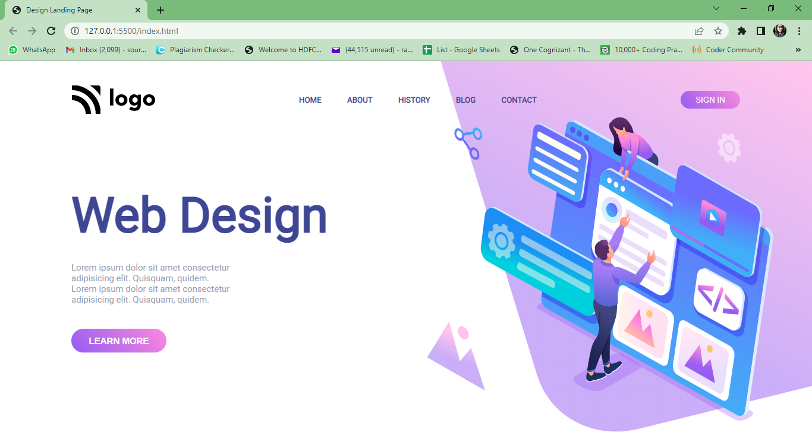

# Web Design Landing Page

 

This is a uniquely designed web page made by using HTML and CSS only. It is also made responsive. Go check it out.

***
### Name: SOURITA RAY
***
## Demo

## Mobile layout

## What have I learnt in this project?

In this project I have learned about :
- Learned how to select an element without class name or ID name.
- Flexbox 
- Media queries
- Background images

## Live Link
[Web Design Landing Page](https://web-design-landing-page-souritaray.netlify.app/)

## Time required to complete the project

About 5 hours.

## Contact me on:

- [Linked In-Sourita Ray](www.linkedin.com/in/sourita-ray-89bab0212)
- [Email-id Sourita Ray](souritaray@gmail.com)

## Feedback

You can provide your feedback at souritaray@gmail.com

